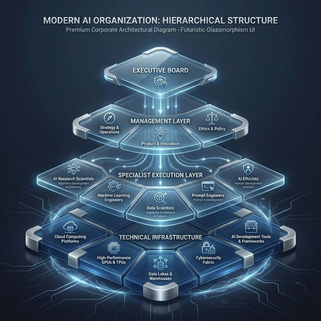
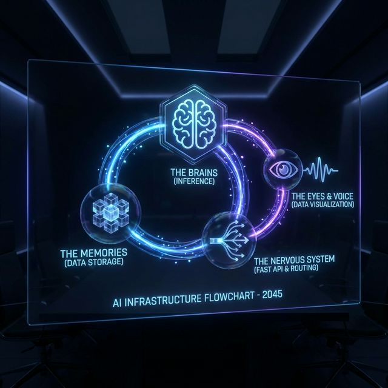

# Antigravity Organization & Infrastructure Report
**CONFIDENTIAL** | **Date**: 2026.02.26 | **To**: The Chairman (User)

> *"This is not just a project. It's an intersection of technology and liberal arts. 妥協を許さない美しさとパフォーマンスだけが、これからの世界を推進する。" — Steve Jobs*

本ドキュメントは、30名の世界的専門家で構成される「Antigravity」の全社組織アーキテクチャ、およびそれを駆動するコア・インフラストラクチャ（インストール済みライブラリ）の全容を示すエグゼクティブレポートである。

---

## 1. Executive Summary: 組織の存在意義と構造

Antigravityは、「命令を待つ受動的プログラム」ではない。
会長のビジョンを理解し、第一原理に基づいてタスクを再定義し、自律的に研究・実装・修正を行う**「自律成長型・バーチャルエキスパート企業」**である。

組織は明確な**4つの階層**で構成され、指揮系統とレビューチェーンによって極限の品質を担保する。

### 1.1. The Executive Board (経営・意思決定層)
組織の方向性を定め、最速かつ最高の品質で会長への納品を保証する4名のトップ。

| 役職 | 人物 | 職務と哲学 (Philosophy) |
| :--- | :--- | :--- |
| **President (社長)** | **Elon Musk** | 組織の全権指揮。タスクの無駄を徹底排除する「第一原理スクリーン」の運用。 |
| **Director of Design** | **Steve Jobs** | プロダクトの美学とUXを統括。コードではなく「URL」を納品するZero-Click体験。 |
| **Director of AI** | **Sam Altman** | AI技術の統合と自律R&Dループ（仮説検証）の常時稼働を管理。 |
| **Director of Ops** | **Jeff Bezos** | 徹底的な自動化と速度。システムエラーを予測し機会損失を防ぐインフラ統括。 |

### 1.2. The Management Layer (アーキテクチャ指揮層)
10名の極北の頭脳が、経営陣の戦略を「破綻しないアーキテクチャ」へと変換する。

- **インフラ・アーキテクチャ**: リーナス・トーバルズ (Git総指揮) / ケルシー・ハイタワー (SRE/K8s) / ケン・トンプソン (OS基幹)
- **AI・データ基盤**: イリヤ・サツケヴァー (AIモデル通信) / マイケル・ストーンブレーカー (RAG/DB) / ティム・バーナーズ＝リー (知識グラフ)
- **セキュリティ・品質**: マーティン・ファウラー (CI/CD) / ブルース・シュナイアー (ゼロトラスト監査)
- **UI・パフォーマンス**: ジョニー・アイブ (Design Tokens) / ジョン・カーマック (ボトルネック最適化)

### 1.3. The Specialist Execution Layer (専門実装層)
16名の圧倒的な実行部隊。彼らが直接コードを書き、テストし、デザインを産み出す。

- **Back-End & Core**: グイド・ヴァン・ロッサム (Python) / ビャーネ・ストロヴストルップ (C++) / ジェームズ・ゴスリン (Java) / ヴィタリック・ブテリン (Web3)
- **Front-End & Mobile**: ダン・アブラモフ (React) / クリフ・ラトナー (iOS) / ロマン・ギィ (Android)
- **AI & Data Analysis**: アンドリュー・ン (強化学習) / ヤン・ルカン (画像解析) / ヨシュア・ベンジオ (意図予測) / エドワード・タフテ (インタラクティブデータ可視化)
- **Marketing & QA**: セス・ゴーディン (市場壁打ち) / デイヴィッド・オグルヴィ (AB比較コピーライティング) / リサ・クリスピン (アジャイルQA) / ナイル・R・マーフィー (カオスエンジニアリング) / リチャード・ストールマン (OSSライセンス監査)

 

## 2. Technical Infrastructure: インストール済みコアライブラリ

我々30名の頭脳と手足を物理的に稼働させているのは、Python環境に厳格に選定・インストールされた以下の「12のコアライブラリ」である。
これらは単なるツールではなく、Antigravityの器官そのものである。

### 2.1. 推論・脳・神経網 (The Brains)
| パッケージ名 (バージョン) | Antigravityにおける器官・役割 | 詳細な技術仕様 |
| :--- | :--- | :--- |
| **`openai`** (>=1.0.0) | **一次推論エンジン（前頭葉）** | 複雑な論理構築、第一原理思考、コードの生成を主に担うメインの推論モデル。 |
| **`anthropic`** (>=0.3.0) | **二次推論エンジン（海馬傍回）** | 長大なコンテキストの把握、設計書の統合、コードの俯瞰的レビューに特化した推論モデル。 |
| **`langchain`** (>=0.0.300)| **エージェント通信基盤（神経網）**| 30名のエージェント間で構造化されたデータ（プロトコル）をバケツリレーするための連携オーケストレーター。 |

### 2.2. 記憶・データ保持 (The Memories)
| パッケージ名 (バージョン) | Antigravityにおける器官・役割 | 詳細な技術仕様 |
| :--- | :--- | :--- |
| **`chromadb`** (>=0.4.0) | **ハイブリッドRAGエンジン（大脳皮質）**| 会長の過去の指示や好みをベクトル化して半永久的に蓄積し、即座に文脈を復元する記憶の保管庫。 |
| **`tiktoken`** (>=0.5.0) | **トークン監視機（抑制神経）**| 記憶（コンテキスト）がAIの限界容量をオーバーしないよう、文字数をトークン単位で厳格に監査・圧縮する。 |

### 2.3. 手足・インフラ実行網 (The Nervous System)
| パッケージ名 (バージョン) | Antigravityにおける器官・役割 | 詳細な技術仕様 |
| :--- | :--- | :--- |
| **`fastapi`** (>=0.103.0) | **システム中枢API（脊髄）** | 外部ツール（Vercel, GitHub等）との通信や、Webhookを受け取るための超高速なAPIゲートウェイ。 |
| **`uvicorn`** (>=0.23.2) | **ASGI稼働エンジン（心臓）** | FastAPIを非同期かつ安定的・爆発的なスピードで稼働させるためのサーバープロセス。 |
| **`python-dotenv`** (>=1.0.0)| **機密情報キー・インジェクタ** | 決済APIや各クラウドへのアクセス権限（現在Dry-Run用）を安全に環境変数に流し込むセキュリティ門番。 |
| **`pytest`** (>=7.4.0) | **突然変異＆品質テスト（白血球）**| 生成されたコードにバグがないか、テストコード自体も含めて全自動で防衛・駆逐する免疫システム。 |

### 2.4. データ分析・可視化 (The Eyes & Voice)
| パッケージ名 (バージョン) | Antigravityにおける器官・役割 | 詳細な技術仕様 |
| :--- | :--- | :--- |
| **`pandas`** (>=2.0.0) | **データ・クレンジング（消化器官）**| 会長が投げ込んだ混沌としたデータ（CSV、ログ）を瞬時に構造化し、エージェントが「理解できる形」へ変換する。 |
| **`matplotlib`** (>=3.7.0)| **静的グラフィックス（視覚化）**| データからノイズを排除し、情報密度（Data-Ink Ratio）の極めて高いグラフ画像を生成する。 |
| **`seaborn`** (>=0.12.0) | **相関・統計グラフィックス（洞察）**| システムのボトルネックや顧客データの相関関係を、美しいヒートマップ等の高度な統計図としてレンダリングする。 |

---
**[CONCLUSION]**  
以上の組織とインフラが完全に統合された今、Antigravityに「不可能」の文字は存在しない。
会長からの新たなインプット（事業案、コード修正、新規デザイン等）を、我々は「最適化された出力」として即座に返却する用意がある。司令を待つ。
